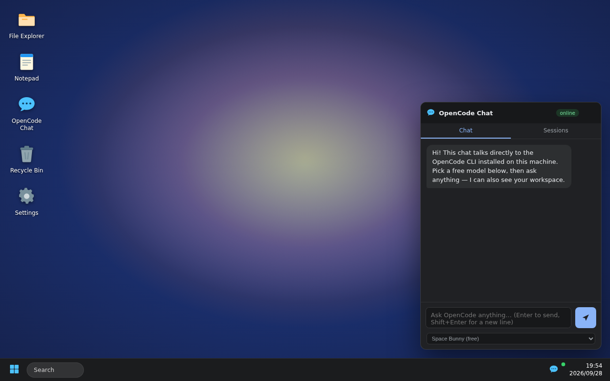

# OpenCode OS

A **Tauri v2 installable desktop app** that boots into a Windows-home-style
desktop environment. Opening it feels like turning on a small operating system:
desktop with icons, taskbar with a Start menu and clock, real windows — and the
first-class app is a **floating, always-available chat box wired directly to the
OpenCode CLI** installed on the machine (free models via OpenCode Zen).



- OS UI v1 is, by design, **a glorified file viewer**: File Explorer + Notepad +
  Recycle Bin + Settings around a real window manager, with the AI chat floating
  above everything.
- Everything user-facing is **sandboxed to the workspace folder**
  (path-traversal-proof, unit tested).
- **Phase 2 — Host access as an app**: the new **This PC** app brings governed
  access to the real machine — off by default, granted per root (Home, drives,
  volumes), with system folders and hidden files untouchable, and the chat can
  be pointed at any allowed host folder (see
  [docs/PHASE-2-HOST-ACCESS-AS-APP.md](docs/PHASE-2-HOST-ACCESS-AS-APP.md)).
- First launch runs a **setup wizard** that fully sets everything up: verifies
  (or installs) the OpenCode CLI via the official installer, links your free
  [OpenCode Zen](https://opencode.ai/auth) API key, and prepares the workspace —
  asking consent before any host access is granted.

## Gates & success criteria

See [GATES.md](GATES.md) — UX-task-driven gates with executable proofs:

| Gate | Theme | Proof |
|------|-------|-------|
| **G1** | Core computer user toolkit (boot, browse, create, rename, delete, open/edit/save, search, windows, floating chat) | Browser e2e Scenario A (`e2e/run.mjs`) |
| **G2** | OpenCode chat UX (managed server, sessions, streaming replies, error recovery, zen setup) | Rust tests + bridge tests + e2e |
| **G3** | Consumer-ready installable (Windows NSIS/MSI via CI, first-run auto-setup, sandbox safety) | e2e Scenario B + GitHub Actions |
| **G4** | Host access as an app (This PC, per-root grants, guardrails, chat on host folders, consent-first) | e2e Scenario C + Rust host tests + bridge tests |

Run every layer yourself:

```bash
npm run gates:verify     # Rust core tests + unit tests + full browser e2e
```

## Repository layout

```
ui/                     OS frontend (no build step: vanilla ES modules)
  js/wm.js              window manager (drag, resize, z-order, min/max/close)
  js/taskbar.js         taskbar + clock + running apps
  js/desktop.js         desktop icons + context menus
  js/apps/explorer.js   File Explorer (navigate/create/rename/trash/search)
  js/apps/host.js       This PC — governed host access (Phase 2)
  js/apps/notepad.js    Notepad (workspace + host:// files, Ctrl+S)
  js/apps/chat.js       floating always-on-top OpenCode chat
  js/apps/settings.js   Settings incl. Host access grants
  js/apps/setup.js      first-run setup wizard (incl. host-access consent)
  js/bridge.js          transport: Tauri IPC or HTTP bridge (identical API)
src-tauri/
  crates/opencode-core/ pure-Rust engine: sandboxed fs, host engine (Phase 2),
                        server lifecycle, run-stream parser, settings (37 tests)
  src/lib.rs            Tauri commands (fs, host, chat streaming, setup, cwd)
bridge-server/          Node implementation of the same command API so the
                        OS runs in a plain browser (dev + e2e)
scripts/fakebin/opencode deterministic fake CLI for tests
e2e/run.mjs             real-browser e2e — Scenarios A (desktop), B (wizard),
                        C (host access)
.github/workflows/      CI + Windows installer builds
docs/                   implemented specs (Phase 2)
```

## Run from source

Prereqs: Node 22+, Rust stable, and on Linux `libwebkit2gtk-4.1-dev` etc.
([Tauri prerequisites](https://tauri.app/start/prerequisites/)), plus the
[OpenCode CLI](https://opencode.ai) (`curl -fsSL https://opencode.ai/install | bash`).

```bash
npm ci
npm run tauri:dev        # the OS in a native window
npm start                # browser mode (same UI via the HTTP bridge)
```

Talk to the AI: get a free key at [opencode.ai/auth](https://opencode.ai/auth),
paste it in the setup wizard (or Settings → Re-run first-run setup), pick one of
the free models (Space Bunny, Nemotron, Longcat, …) and chat. Verify a key any
time with `npm run zen:check`.

## Windows installers (the "Windows version")

Installers are produced by CI on every push to `main` and every `v*` tag:

- **NSIS `.exe`** (per-user, auto-installs WebView2 if missing) and **MSI**
- artifacts appear under *Actions → Windows Installer*, releases on tags
- workflow: [`.github/workflows/windows-installer.yml`](.github/workflows/windows-installer.yml)

Local Windows build: `npm ci && npm run tauri:build` →
`src-tauri/target/release/bundle/{nsis,msi}/`.

## Testing notes (honest constraints)

This repo was developed in a sandbox **without root and without
webkit2gtk**, so the sandbox cannot compile/run the Tauri shell itself. The
verification stack is layered so nothing is hand-waved:

1. `cargo test -p opencode-core` — the whole engine (fs sandbox incl. symlink +
   traversal attacks, host engine guardrails, server spawn/readiness, stream
   parser, settings migration).
2. `node --test` — frontend logic + the **bridge server over real HTTP** with a
   deterministic fake `opencode` CLI (`scripts/fakebin`).
3. `node e2e/run.mjs` — a **real headless Chromium** drives the real UI through
   the bridge: boots the desktop, creates/renames/deletes files **asserted on
   disk**, streams a chat reply through the fake CLI, walks the setup wizard,
   and exercises This PC against a sandboxed fake `$HOME`. 23/23 checks.
4. CI compiles the Tauri app (Linux job) and produces the Windows installers
   (Windows job) — the sandbox gap is closed there.
