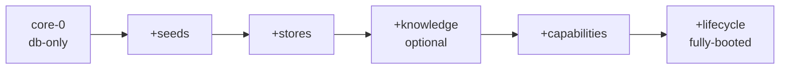

# Core Model — Core vs Core+X (what runs minimally, what the +X adds)

> "Core" = what boots and serves with nothing optional. "+X" = what each subsystem
> adds, its switch, and what breaks without it. Derived from `BootPhase`
> (`db-only|seeds-done|engines-ready|fully-booted`), `createServer` vs
> `createServerWithEngines` (`server/index.ts`), `config.ts` gates, and router guards
> (`&& autonomousRouter`, `only when relocationEngine`, etc.).

## 1. The ladder (each rung includes everything below)

| Rung | Boot | What's live | Switch |
|------|------|-------------|--------|
| **core-0** (db-only) | `createServer` (minimal stub, no `bootstrapEngines`) | `db` + `eventBus` + `nlclEngine` (deterministic, no external deps) + `NodeStoreImpl` + resource routers (`nodes/collections/containers/content/notifications/contacts/sync/media/tunnel`) + `generative` (in-memory) | default for tooling/tests |
| **core-1** (+seeds) | `bootstrapSeedsPhase` | provider registry (`PROVIDER_MANIFESTS`), taxonomy prospects, parser seeds, harness commands | `seed all` |
| **core-2** (+stores) | `bootstrapStoresPhase` | all store impls + governor + CDP + `ConversationManager` | — (phase order fixed) |
| **core-3** (+knowledge, optional) | `bootstrapKnowledgePhase` | ingestion/extraction/search/synthesis, embeddings (hf/minilm/ollama) | skipped when providers absent |
| **core-4** (+capabilities, central) | `bootstrapCapabilitiesPhase` | registry + all cap sets + MCP + memory fabric; degraded-but-booting if it fails | `surfaces.enforceParity` gate |
| **core-5** (+lifecycle, full) | `bootstrapLifecyclePhase` | NLCL + kernel + health + reliability + router stores → `fully-booted` → `/readyz` ready | `createServerWithEngines` (only `serve` calls it) |

## 2. The +X switches (what each extension costs/gives)

| +X | On-switch (default) | Gives | Without it |
|----|--------------------|-------|------------|
| AI gateway | `AI_GATEWAY_ENABLED=1` (off) | `cap:ai:execute` via gateway/router/policy | returns not-enabled (no silent fallback) |
| ExecutionKernel | `VIVIM_EXECUTION_KERNEL=1` (off, alpha) | tier-blocking → execute → verify → journal for destructive/financial/communication | NLCL P0 policy blocks, HITL only |
| Fleet autostart | `fleet.autoStart` (false) | Chrome slaves at boot | lazy launch on first need (default) |
| Tunnel/P2P | `VIVIM_TUNNEL_ENABLED=1` / `VIVIM_P2P_ENABLED=1` (on) | `/api/tunnel/*`, remote peers | local-only |
| OpenCode serve | `OPENCODE_SERVE_ENABLED` (off) | `/api/opencode/*` (send/session/instances/permission) | 503 |
| DB encryption | `CAP_STORE_ENCRYPT_DB` (off) | SQLite encryption via `db-encryption.ts` | plaintext at rest |
| Auth | `CAP_STORE_AUTH_TOKEN` (unset = dev allow-all) | bearer gate on all but setup/health/docs | open localhost |

## 3. Reader's rule

Debugging? Assume core-0 works (if not, it's `db`/ports/auth — see `quickstart.md` §5). Capability missing? It's a core-4 concern (binding/program/slot). Parser/memory blank? Core-3. Nothing at all? Check `BootPhase` + `/readyz` before anything else.
