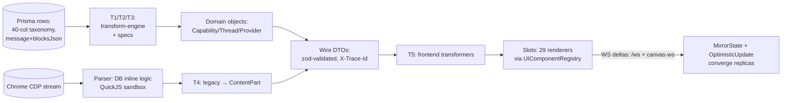
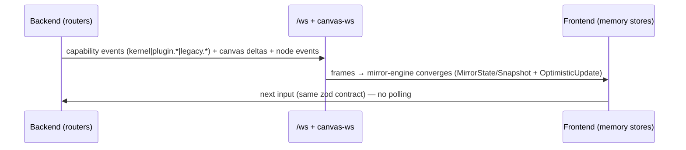

# Data Flows & Transformations — Where Rows Become Pixels (with mermaid)

> Sources: `src/transform/{types,transform-engine,index}.ts` + `specs/{capability,conversation,provider}-spec.ts`,
> `shared/stream-blocks.ts` (re-export of `@/schema/streaming.js`), `src/engines/stream-parser.ts`
> (DB-only logic), `src/storage/contracts/*` rows, `frontend/src/api/transformers.ts`,
> mirror/sync engines (`mirror-engine`, `sync-engine`, `canvas-mirror`), `websocket.ts` + `canvas-ws.ts`.

## 1. The five transformations (row → domain → wire → pixel)

| # | Transform | From → to | Rules (from spec headers) | Home |
|---|-----------|-----------|---------------------------|------|
| T1 | capability-spec | `CapabilityTaxonomyRow` → `CapabilityDomain{id,slug,name,surfaces,inputSchema,…}` | drop layout internals; `inputType` CSV → `surfaces[]`; `uiInputSchema` JSON-parse; `requiresUserConfirmation` 0/1→bool; exclude `mutationEffectsJson/recoveryBehavior` | `transform/specs/capability-spec.ts` (`FieldMapping[]`, `intToBool`, `safeJsonParse`) |
| T2 | conversation-spec | message rows → thread domain | `blocksJson` parse; order by `sequenceIndex`; `identityHash` dedupe via `hashContent` (sha256, fnv1a dedup-only) | `transform/specs/conversation-spec.ts` |
| T3 | provider-spec | provider definition rows → provider domain | endpoints/models/accounts/stream-config join by `slave:{provider}:{account}` | `transform/specs/provider-spec.ts` |
| T4 | stream migration | `LegacyBlock` → `ContentPart/ContentBlock` | `migrateLegacyBlock/migrateLegacyParts/isLegacyBlock/extractText/blockKindOf/isStreaming` — frontend imports ONLY from `shared/stream-blocks.ts` (boundary declared there) | `shared/stream-blocks.ts` (18 lines) |
| T5 | frontend transformers | backend DTO → view model | `frontend/src/api/transformers.ts` mirrors backend routers 1:1; memory impls converge via WS, never persist | `frontend/src/api/*` |

## 2. Conventions every transformation obeys (from code)

- Times are epoch-ms numbers, booleans are `0|1`, evolving shapes are `*Json` TEXT parsed by `safeJsonParse` (never trust raw JSON).
- `0|1 → boolean` and `CSV → array` happen in exactly one place (the spec), never in engines or UI.
- Cross-DB joins are string keys (`slave:/cap:/bind:/prog:/sel:`, content hash) — greppable, no SQL JOIN across DBs (I-3).
- New queryable flag = new real column from day one; new evolving shape = JSON blob (see `data-architecture.md` §3).

## 3. Sync/convergence flow (realtime path)

