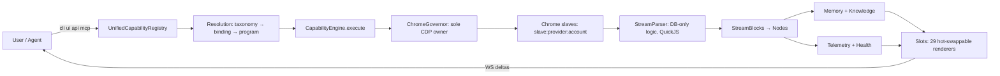
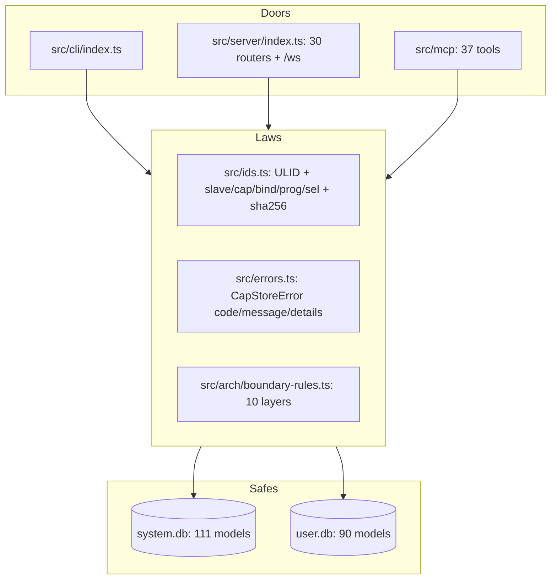
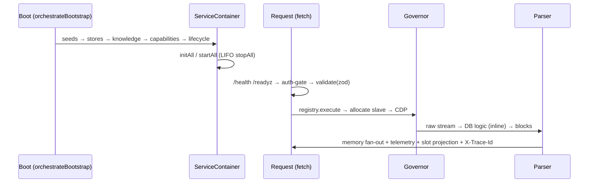
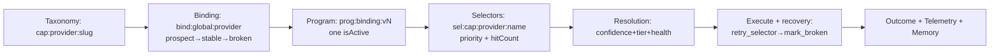

# Mental Models — Plain English + Zoomable Mermaid (start here, then zoom)

> Each model below is one paragraph of plain English + one mermaid diagram + the
> code homes. Zoom OUT for the shape, zoom IN for the file. No prior docs read.

## 0. The one-sentence model

Vivim is a **local-first switchboard**: every browser action is a versioned capability, executed only through one Chrome governor, persisted through typed contracts, projected into swappable UI. (`package.json: vivim-final@1.0.0`, `src/index.ts` barrel, `src/cli/index.ts`, `src/server/index.ts`, `src/mcp/server.ts`)

## 1. Zoom OUT (L0: the three doors + two safes)

Plain English: three ways in (operator CLI, serving HTTP+WS, agent MCP), two safes underneath (system DB ships with the release, user DB survives reinstall). One law for IDs, one for errors, one for layers.

Homes: `L0-system-overview.md`, `L4-contracts/shared-kernel.md`, `architecture/data-architecture.md`.

## 2. Zoom MID (boot → request → project)

Plain English: the system wakes in five phases (seeds→stores→knowledge→capabilities→lifecycle), then every request walks the same corridor (auth→validate→registry→governor→parser→memory→telemetry→slots). Minimal boot stops after seeds (`db-only`); full boot runs all five (`fully-booted`).

Homes: `architecture/boot-and-runtime.md`, `architecture/capability-lifecycle.md` (9 steps), `architecture/configuration.md` (ports 9420/9222-9250/9300-9400).

## 3. Zoom IN (one capability's life)

Plain English: a global action (e.g. `chat.send`) is bound per provider, implemented by versioned programs, located by selector strategies, resolved by confidence+tier+health, executed with a 5-step recovery chain, and remembered as outcome + telemetry.

Homes: `02-GLOSSARY.md` §A, `L4-contracts/data-dictionary.md` §0 (join keys), `architecture/error-catalog.md`.

## 4. Zoom SIDEWAYS (data mirrors the same shape everywhere)

Plain English: conversation messages, stream blocks, nodes, mirror states, and canvas layers are all the same idea — append-only atoms with hashes, converged over WebSocket. Memory is three drawers (episodic events, semantic facts + embeddings, procedural rules).

Homes: `architecture/data-architecture.md`, `L4-contracts/data-dictionary.md`, `architecture/data-flows.md`.

## How to use this file

Lost? Read §0 only. Integrating? Read §2 + `api-reference.md`. Debugging? §3 + `error-catalog.md`. Shaping bricks? §0 + `shaping-intel.md` (matrices, no prescriptions).
