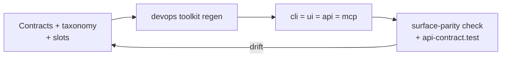

# Reprogrammability — How the App Rewrites Itself (from `src/reprogrammability/` 15 files)

> Sources: `contract.ts` (181 lines, `CONTRACT_VERSION = 1`), `canonical-surfaces.ts`,
> `registry.ts`, `mutation-schema.ts` (8 ops), `variant-schema.ts`, `schema/spec.ts`,
> `dsl/{grammar,parser,executor}.ts` (+ tests), `devops/toolkit/{regen,surface-parity}.ts`.

## 1. The contract (the law of self-editing)

- **Everything visible is a `ReprogrammableSurface`** (invariant 1): kinds `card|panel|layer|primitive|chrome|slot|custom` (`SurfaceKind`). `custom` (`{schemaUrl,data}`) is the escape hatch; audits flag it for promotion.
- **Every change is one of 8 mutation ops** (invariant 2, `mutation-schema.ts`): novel ops require a contract amendment (Phase 10). `SurfaceMutation` is the single shape the Composer, Reprogram Modal, Visual Builder, LLM Harness, and Plugin SDK v2 all speak.
- **Every mutation is logged with provenance** (invariant 3) and **reversible** (invariant 4). Provenance order most→least trusted: `manual > nlcl > prefix > plugin > llm-harness > system` (`MutationProvenance`; `system` = boot/migration/restore: highest privilege, lowest trust — always logs, may notify).
- `CONTRACT_VERSION = 1` — bump on breaking change; the Phase-10 check enforces the doc reference matches.

## 2. Surfaces, registry, variants, DSL

- `canonical-surfaces.ts` + `registry.ts`: the catalog of what can be rewritten; `schema/spec.ts` (`SurfaceSpec`) types each kind.
- `variant-schema.ts`: named variations per surface (A/B, per-provider, per-tier).
- `dsl/grammar.ts → parser.ts → executor.ts` (+ executor/parser tests): a small language for expressing mutations deterministically (no LLM needed for 95% — same philosophy as `nl_command`).
- UI projection: `mutation-caps.ts` (`registerCanvasMutationCaps`), routers `/api/mutation|surface|template|variant/*`, slots resolve the result.

## 3. Regen loop (how surfaces stay in sync)

Configurability hook: 13 tunables (`configuration.md`) + `.runtime/config.tunables.json` via `devops toolkit config set` — runtime-reconfigurable without restart; static rest via env (`CAP_STORE_*`, `VIVIM_*`). The shaping team reads the knob-reference matrix (`gen-shaping-config-refs.md`) to see which files each knob reaches.
